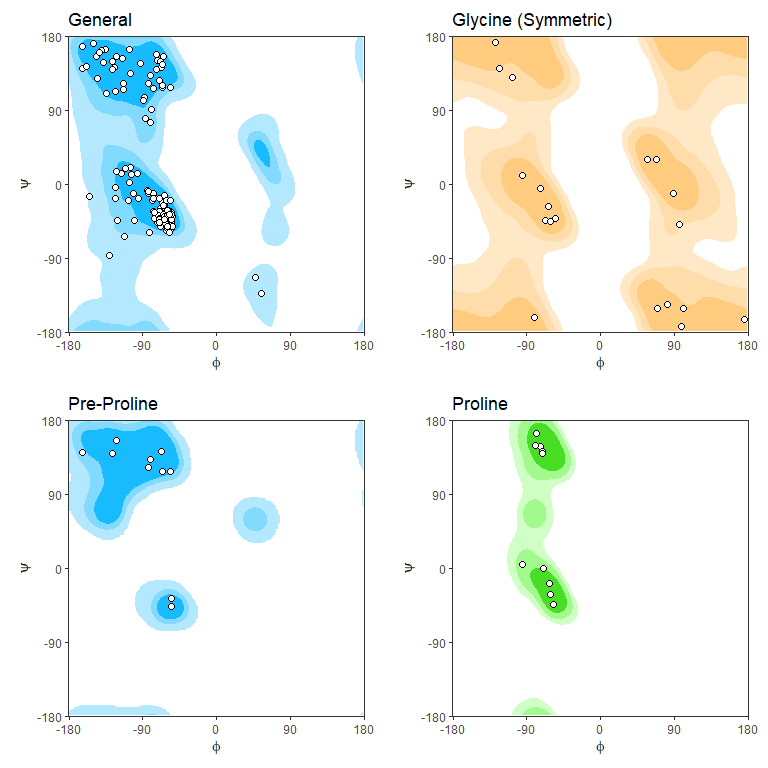

<!-- README.md is generated from README.Rmd. Please edit that file -->

# ggrama

<!-- badges: start -->

[](http://www.repostatus.org/#active)
[](https://opensource.org/licenses/MIT)
[](https://zenodo.org/badge/latestdoi/424568391)
<!-- badges: end -->

The goal of ggrama is to make it easy to plot Ramachandran diagrams from
a pdb file using ggplot2 graphics.

## Installation

You can install the development version of ggrama:

``` r
devtools::install_github("missuse/ggrama")
```

## Example

``` r
library(ggrama)

#download a pdb file
download.file("https://files.rcsb.org/download/2ADQ.pdb1.gz",
              dest = "2ADQ.pdb1.gz")

#plot by type of Ramachandran diagrams
ggrama("2ADQ.pdb1.gz") #general type the default
```


``` r
ggrama("2ADQ.pdb1.gz", "pre.pro") #pre-proline, additional options are glycine and proline
```


Or plot all four types in a grid

``` r
ggrama_all("2ADQ.pdb1.gz")
```


Using contours:

``` r
ggrama_all("2ADQ.pdb1.gz",
           contour = TRUE) #contours
```


``` r
ggrama_all("2ADQ.pdb1.gz",
           contour = TRUE, #contours
           smooth = TRUE) #use smoothed background
```



## Citation

To cite `ggrama` in publications use:

> > Milan Dragicevic (2021), ggrama: Ramachandran diagrams using ggplot2
> > graphics. url: <https://github.com/missuse/ggrama>. doi:
> > 10.5281/zenodo.5660975

A BibTeX entry for LaTeX users is

``` bibtex
  @Manual{,
    title = {ggrama: Ramachandran diagrams using ggplot2 graphics},
    author = {Milan Dragicevic},
    year = {2021},
    url = {https://github.com/missuse/ggrama},
    doi = {https://doi.org/10.5281/zenodo.5660975},
  }
```
