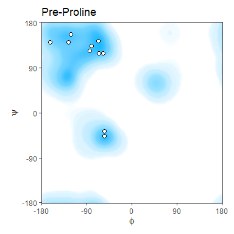

<!-- README.md is generated from README.Rmd. Please edit that file -->

# ggrama

<!-- badges: start -->
<!-- badges: end -->

The goal of ggrama is to make it easy to plot Ramachandran diagrams from
a pdb file using ggplot2 graphics.

## Installation

You can install the development version of ggrama:

``` r
devtools::install_github("missuse/ggrama")
```

## Example

``` r
library(ggrama)
#> Loading required package: ggplot2

#download a pdb file
download.file("https://files.rcsb.org/download/2ADQ.pdb1.gz",
              dest = "2ADQ.pdb1.gz")

#plot by type of Ramachandran diagrams
ggrama::ggrama("2ADQ.pdb1.gz") #general type the default
```


``` r
ggrama::ggrama("2ADQ.pdb1.gz", "pre.pro") #pre-proline, additional options are glycine and proline
```



``` r
#or plot all four types in a grid
ggrama_all("2ADQ.pdb1.gz")
```


